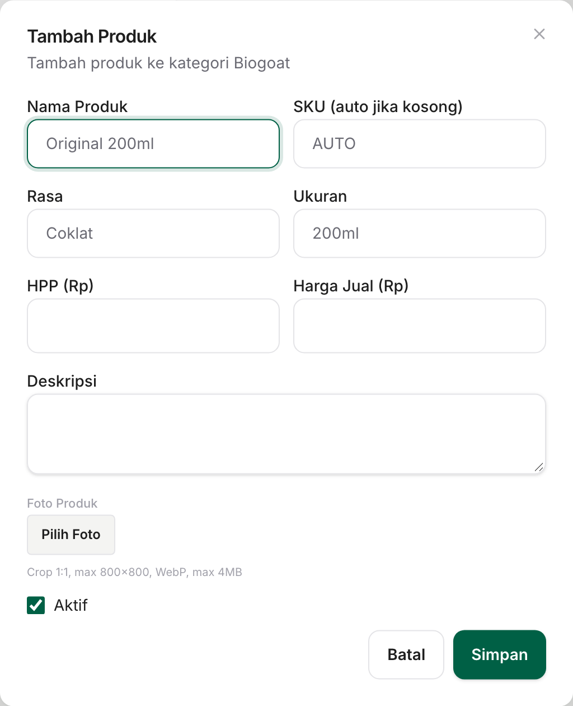

# Panduan Foto Produk

Panduan ini untuk tim Dombi yang menyiapkan foto produk agar tayang di aplikasi. Tidak perlu pengetahuan teknis: semua pengaturan gambar — pemotongan, pengecilan, dan pengubahan format — dikerjakan otomatis oleh aplikasi.

## Ringkasan cepat

| Hal                                | Ketentuan                                    |
| ---------------------------------- | -------------------------------------------- |
| Siapa yang mengunggah              | Hanya akun dengan peran **Owner**            |
| Jumlah foto untuk katalog saat ini | **7 foto** — satu per rasa, bukan per produk |
| Bentuk foto                        | **Persegi (1:1)**                            |
| Ukuran ideal                       | **1200 × 1200 piksel**, minimum 800 × 800    |
| Ukuran berkas                      | **Maksimum 4 MB**                            |
| Format                             | JPG, PNG, atau WebP                          |

## Kenapa 7, bukan 13?

Produk dikelompokkan per **rasa**. Satu rasa punya dua ukuran — 250ml dan 1L — dan keduanya memakai **foto yang sama**. Jadi cukup satu foto per rasa, tidak perlu memotret dua kali.

## Tujuh foto yang dibutuhkan

| #   | Produk               | Rasa     | Dipakai oleh ukuran |
| --- | -------------------- | -------- | ------------------- |
| 1   | Domilk Original      | Original | 1L + 250ml          |
| 2   | Domilk Premium Taste | Coklat   | 1L + 250ml          |
| 3   | Domilk Premium Taste | Vanilla  | 1L + 250ml          |
| 4   | Domilk Premium Taste | Stroberi | 1L + 250ml          |
| 5   | Domilk Premium Taste | Coffee   | 1L + 250ml          |
| 6   | Biogoat              | Original | 1L + 250ml          |
| 7   | Raw Milk by Domilk   | Fresh    | 1L                  |

## Spesifikasi foto

**Wajib dipenuhi** — kalau tidak, unggahan ditolak atau hasilnya buruk:

- Bentuk **persegi (1:1)**. Aplikasi memotong dari tengah, jadi bagian tepi yang berlebih akan hilang.
- Sisi terpendek **minimal 800 piksel**. Lebih kecil dari itu akan dinaikkan ukurannya oleh aplikasi dan hasilnya terlihat kabur. **1200 × 1200** adalah titik aman.
- Ukuran berkas **di bawah 4 MB**.
- Format **JPG, PNG, atau WebP**.

**Sebaiknya** — supaya katalog terlihat rapi dan seragam:

- Subjek berada **di tengah** foto, karena pemotongan dilakukan dari tengah.
- Latar **polos dan seragam** untuk semua produk, bukan latar transparan.
- Pencahayaan rata tanpa bayangan keras; kemasan menghadap depan dan tegak.
- Tidak perlu menambahkan tulisan atau label di dalam foto — aplikasi sudah menampilkan nama, rasa, dan harga.

## Cara mengunggah

1. Masuk ke aplikasi dengan akun **Owner**.
2. Buka menu **Produk**, lalu pilih **Kategori Produk**.
3. Pilih kategori produknya, lalu klik tombol **Kelola** pada kategori tersebut.
4. Di tabel produk, cari produk dengan rasa yang ingin difoto, lalu klik ikon **pensil** di kolom **AKSI**.
5. Pada bagian **Foto Produk**, klik **Pilih Foto** dan pilih berkasnya.
6. Klik **Simpan**. Aplikasi otomatis memotong foto menjadi persegi, mengecilkannya, dan mengubahnya ke format WebP.

> Foto yang diunggah berlaku untuk **seluruh ukuran** rasa tersebut. Setelah foto Coklat diunggah, kemasan 250ml dan 1L sama-sama langsung menampilkannya.

## Cara memeriksa hasilnya

Di halaman kategori tersedia filter **Has Image** dan **No Image**. Gunakan **No Image** untuk melihat daftar produk yang belum punya foto — kalau daftarnya kosong, semuanya sudah beres.

## Kalau ada masalah

| Yang terlihat                                 | Sebab dan solusinya                                                                        |
| --------------------------------------------- | ------------------------------------------------------------------------------------------ |
| Muncul pesan bahwa berkas terlalu besar       | Berkas melebihi 4 MB — kecilkan dulu sebelum diunggah                                      |
| Foto tampak kabur atau pecah                  | Sumbernya lebih kecil dari 800 × 800 lalu ikut diperbesar — pakai minimal 1200 × 1200      |
| Bagian atas atau bawah foto terpotong         | Aplikasi memotong ke bentuk persegi dari tengah — siapkan foto 1:1 dengan subjek di tengah |
| Muncul gambar emoji 🥛 di aplikasi            | Rasa itu belum punya foto                                                                  |
| Mengunggah satu foto, dua produk ikut berubah | Memang demikian — kedua ukuran berbagi satu foto rasa                                      |
| Menghapus foto                                | Bagian **Foto Produk** juga punya tombol hapus; produk akan kembali menampilkan emoji 🥛   |

## Daftar periksa sebelum tayang

- [ ] Tujuh rasa di atas sudah punya foto
- [ ] Semua foto persegi (1:1) dan minimal 800 × 800
- [ ] Semua berkas di bawah 4 MB
- [ ] Latar dan pencahayaan seragam antarproduk
- [ ] Filter **No Image** di setiap kategori sudah kosong
